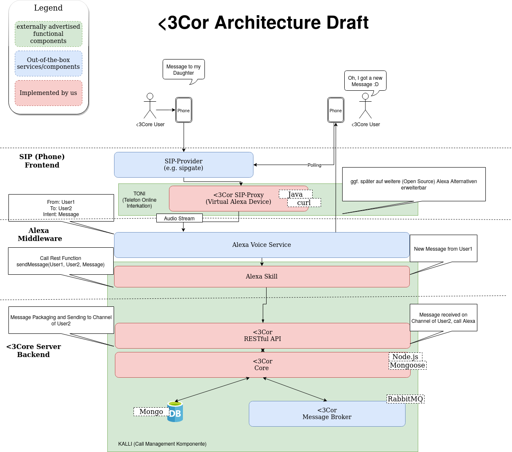
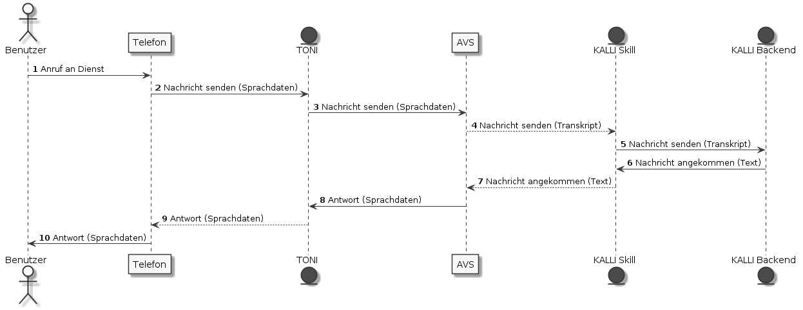

# heartcor-doc
Dieses Repository enthält die Dokumentation zum Beitrag [<3cor](https://heartcor.org) im [Wir vs. Virus Hackathon](https://wirvsvirushackathon.devpost.com/).

## Softwarearchitektur
Die bisherige Implementierung von <3cor basiert auf zwei funktionalen Komponenten:
1. TONI - Telefonische ONline Integration: unser Telefon zu Alexa Gateway
2. KALLI - Call-management: unser Alexa Skill zum senden und empfangen von Nachrichten

### TONI
Toni ist als Java Dienst umgesetzt, welcher als virtuelles Amazon Alexa Gerät agiert und den Ton von Anrufen an den [Alexa Voice Service](https://developer.amazon.com/de-DE/alexa/alexa-voice-service) weiterleitet.
Um den Dienst zu betreiben sind ein Konto auf Amazon Seite sowie ein SIP Zugang erforderlich, für unsere Tests haben wir hier auf [Sipgate](https://www.sipgatebasic.de/) gesetzt.
Ist der Dienst bereitgestellt, so ist dieser dann als normaler Festnetzanschluss erreichbar.
Die Implementierung des Dienstes findet ihr auf Github als [wir-vs-virus-cas/heartcor-sip-proxy](https://github.com/wir-vs-virus-cas/heartcor-sip-proxy).

### KALLI
Das Call-management ist technisch in mehrere Subkomponenten aufgeteilt. Das Nutzerinterface ist momentan als Alexa Skill implementiert. Der Quellcode ist in unserem Repository [wir-vs-virus-cas/heartcor-alexa-skill](https://github.com/wir-vs-virus-cas/heartcor-alexa-skill) zu finden.
Dieser beinhaltet neben der Skilldefinition die Quellen für den Dienst, welcher zusätzlich bereitgestellt werden muss.
Für unser Hosting setzen wir auf [Tomcat](https://tomcat.apache.org/) mit [nginx](https://nginx.org/) als Reverse Proxy für SSL.
Die notwendigen Zertifikate kommen von [Let's Encrypt](https://letsencrypt.org/).

Dieser Skill greift auf unseren Backend-Dienst zu, der entsprechende Quellcode ist auf Github unter [wir-vs-virus-cas/heartcor-server](https://github.com/wir-vs-virus-cas/heartcor-server) zu finden.
Technisch gliedert der Dienst sich in eine API und einen funktionalen Kern.
Für die Datenhaltung nutzen wir hier auf [MongoDB](https://www.mongodb.com/download-center/community) und [RabbitMQ](https://www.rabbitmq.com/).
Weitere Dienste wie die konzeptionell geplante grafische Oberfläche können ebenfalls auf dieses Backend zugreifen.

## Zusammenspiel der Dienste & Implementierungsstand

Im folgenden Diagramm ist das Zusammenspiel der Dienste dokumentiert.
Durchgezogene Pfeile symbolisieren dabei implementierte Teilschritte, gestrichelte noch zu implementierende.
Da sich das senden einer Nachricht gegenüber dem Empfangen einer Nachricht nur im Inhalt von Anfrage und Antwort unterscheidet, werden beide Fälle anhand eines Diagramms erläutert.

Um den Internetzugriff zu ermöglichen greifen wir mit dem Telefon in Schritt 1 und 10 auf bestehende Technologie zurück.
Der von uns implementierte Proxy setzt die Sprachdaten zwischen Schritt 2 und 3 vom SIP Protokoll um und leitet diese an AVS weiter.
AVS Transkribiert die Daten und gibt die Anfrage als Transkript an den Skill (Schritt 4), welcher diese an das Backend weiterleitet (Schritt 5).
Die Methoden zum speichern und abrufen von Nachrichten sind im Backend umgesetzt, fehlen im Skill aber bisher noch.
Die Trennung in Teilschritte ist hier erfolgt, um das Backend für weitere Zugriffsmöglichkeiten (ggf. grafische Oberfläche) weiter nutzen zu können.
Seitens des Backends wird beim Verarbeiten der Anfrage nun entweder eine Erfolgsmeldung (Senden einer Nachricht) oder der Inhalt vorhandener Nachrichten (Abruf der Nachrichten) zurückgegeben (Schritt 6) und vom Skill an AVS weitergeleitet (Schritt 7).
AVS setzt die textuelle Antwort nun in Sprache um und sendet diese an den Proxy zurück (Schritt 8).
Der Proxy setzt diese nun auf das SIP Protokoll um und leitet sie and Telefon zurück (Schritt 9).